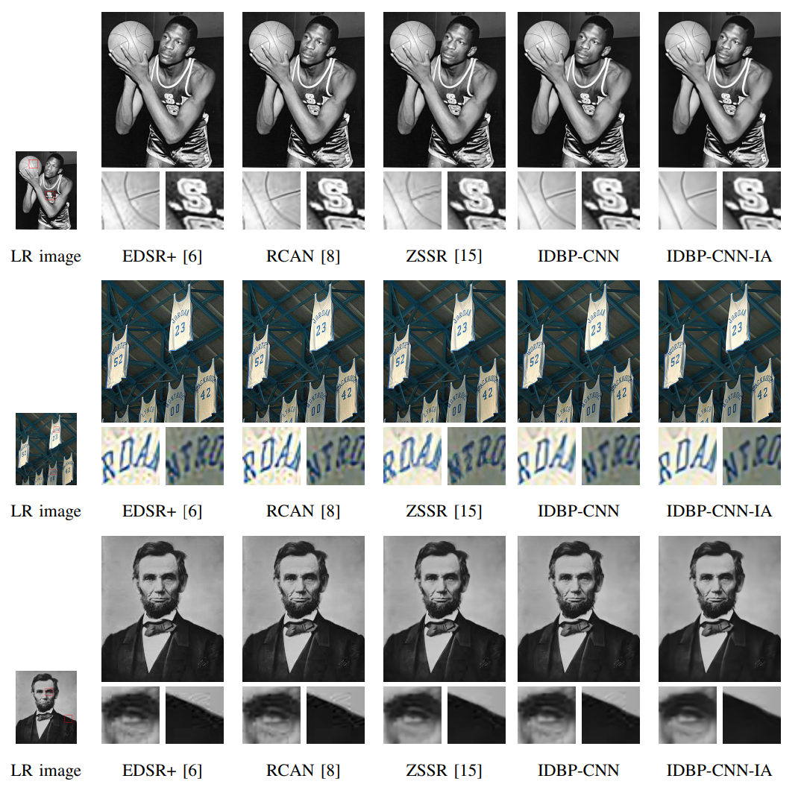

# IDBP-CNN-IA
Super-Resolution via Image-Adapted Denoising CNNs: Incorporating External and Internal Learning 
https://arxiv.org/pdf/1811.12866.pdf, IEEE SPL, 2019.

@article{tirer2019super,  
  &nbsp; &nbsp; title={Super-resolution via image-adapted denoising CNNs: Incorporating external and internal learning},  
  &nbsp; &nbsp; author={Tirer, Tom and Giryes, Raja},  
  &nbsp; &nbsp; journal={IEEE Signal Processing Letters},  
  &nbsp; &nbsp; year={2019},  
  &nbsp; &nbsp; publisher={IEEE}  
}

This work uses the offline trained CNN denoisers from https://github.com/cszn/IRCNN.
Please cite IRCNN paper too if you use our code for your research.

MatConvNet package is required.

# SRx2 for old LR images
 

